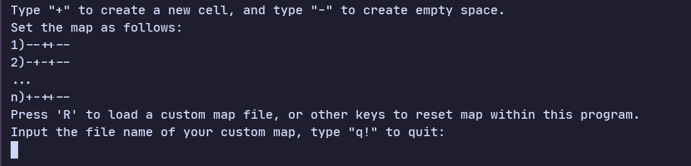
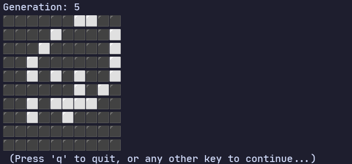

# Game_Of_Life
A terminal-based Conway's game of life, written in C++, running on both Linux and Windows.

---

## Features

- Light-weight
- You can load your custom map file easily

---

## Tutorial

When editing your map, just remember that:

- "+" stands for a living cell
- "-" stands for an empty block
- Both the x and y coordinate of the game map must be in the interval of (0, 100]
- Your custom map file must be in pure text format
- Remember to state the length and width of your custom map at the beginning your map file
- check for "example_map.txt" if you need help on creating a custom map file

---

## Screenshots

